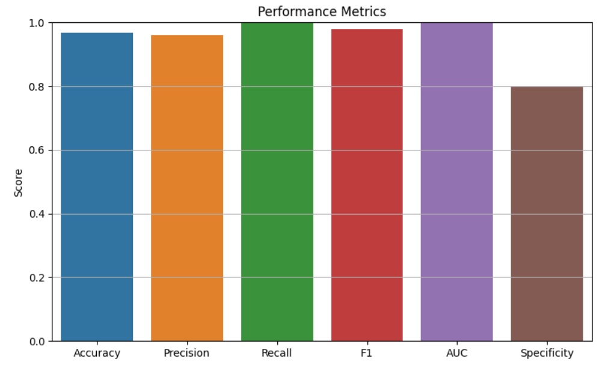
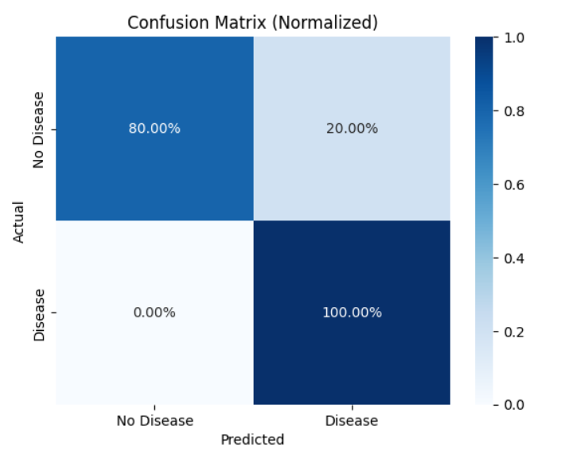
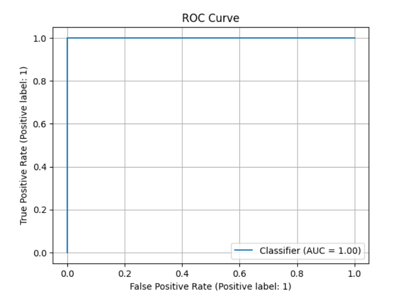
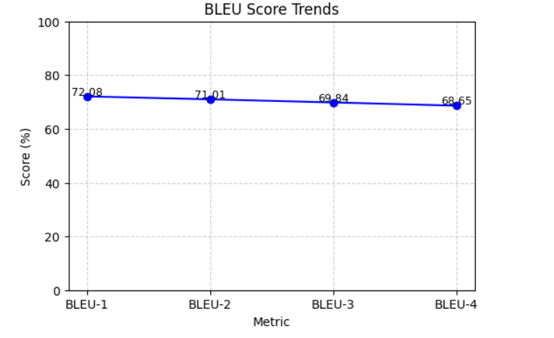
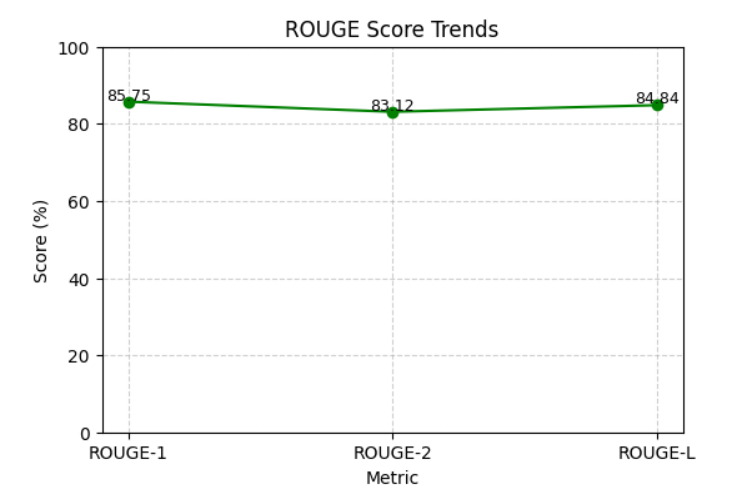

# Multimodal Medical Report Summarization & Disease Classification

This project combines **medical imaging** (X-rays) and **radiology text reports** to perform two key tasks:  

1. **Disease Classification** – Predicts abnormal findings (e.g., effusion, cardiomegaly, pneumothorax, etc.).  
2. **Report Summarization** – Generates concise summaries of findings using a pretrained BART model.  

The model leverages:  
- **BERT** for radiology report encoding  
- **ResNet18** for chest X-ray feature extraction  
- **BART (CNN)** for abstractive summarization  
- Fusion of text & image features for classification  

## ⚙️ Features
- Multimodal architecture (images + text)  
- Abnormality detection with evaluation metrics  
- Medical report summarization using **NLP metrics (BLEU, ROUGE)**  
- Visualizations for classification & summarization performance  

## 📂 Dataset
- Radiology text reports & paired images (`indiana_merged.csv` & image folder)  

## 📊 Results & Visualizations

### 🔹 Performance Metrics

### 🔹 Confusion Matrix

### 🔹 ROC Curve

### 🔹 BLEU Score Trends

### 🔹 ROUGE Score Trends

## 🧮 Evaluation Metrics
**Classification Metrics**  
- Accuracy, Precision, Recall, F1, AUC, Specificity  

**Language Metrics**  
- BLEU-1: 72.08  
- BLEU-2: 71.01  
- BLEU-3: 69.84  
- BLEU-4: 68.65  
- ROUGE-1: 85.75  
- ROUGE-2: 83.12  
- ROUGE-L: 84.84  

## 🚀 Tech Stack
- **Python, PyTorch, Transformers**  
- **BERT, ResNet18, BART**  
- **Matplotlib, Seaborn, scikit-learn, NLTK, rouge-score**  

